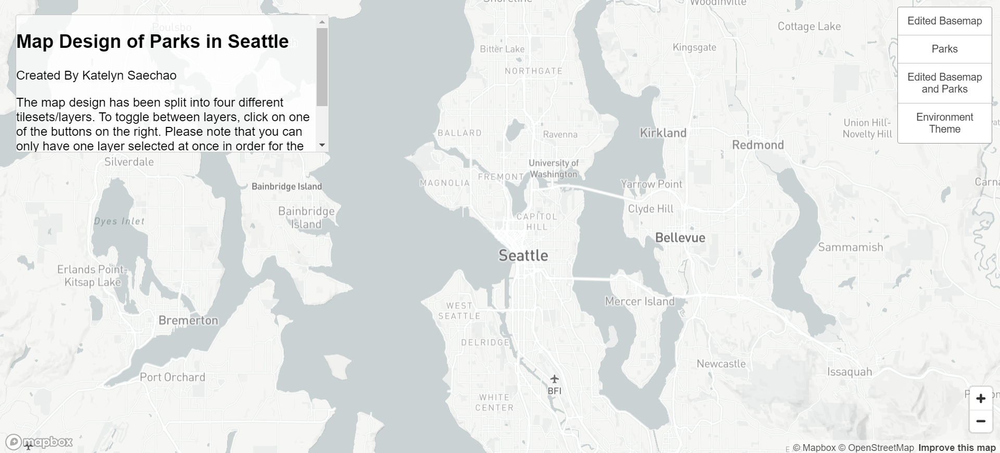

# Map Design of Parks in Seattle

**Click [HERE](https://katelynsaechao.github.io/Parks-in-Seattle-Washington/index.html) to access the Map Design of Parks in Seattle!**

## Screenshots of the four layers

### *Initial map before selecting a layer*

### *First layer: Edited Basemap*

### *Second layer : Parks*

### *Third layer : Edited Basemap and Parks*

### *Fourth layer : Environment Theme*

## Examined Geographic Area
For this map, I chose Seattle to be the examined geographic area.

## Available zoom levels of each tile set
For each tile set, I set the minimum zoom level to 3 and the maximum zoom level to 14. So, the available zoom levels are from 3 to 14.

## Brief Description of Each Tile Set

### *First layer: Edited Basemap*

### *Second layer : Parks*

### *Third layer : Edited Basemap and Parks*

### *Fourth layer : Environment Theme*
